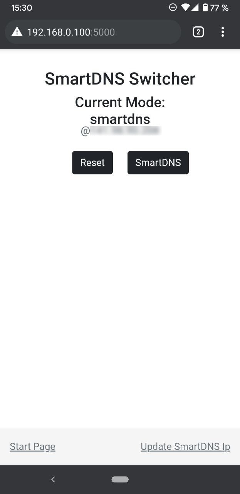

# dnsmasq-switcher

This web application is part of a system to enable/disable SmartDNS for devices on your network dynamically. I got tired of changing the DNS settings of my TV (which does not allow installing VPN apps) manually to watch Netflix US. This system now enables me to switch the TV's Netflix location via a button press on my phone.

The system is a proof of concept, but it works. The basic idea is:

-   A Linux host (in my case, a Raspberry Pi 3 B+), that runs a DNS server (_dnsmasq_) for your local network.
-   The devices in your network use the local DNS server instead of your router (or whatever you set).
-   The local DNS server redirects all DNS queries to either a standard DNS server (1.1.1.1) or a SmartDNS server (you get the IP from your VPN provider).
-   The web app in this repository can be used to switch between those two DNS modes easily.

## FAQ

### What can I do with it?

Enable/Disable SmartDNS on other/multiple devices via a button click. SmartDNS allows to bypass geolocking.

### Why can't I just use a VPN on my device?

On most smart TVs, you can't install VPN apps. For phones and computers, you don't need this system.

### Why can't I use a network-wide VPN via a gateway?

This was my initial idea and is much more common and easy. But that way, you can only enable/disable the VPN for your whole network, re-routing all network traffic of all devices. I want to watch US series on the TV while also gaming without a VPN.

But you can also combine this system with a VPN! I use it in combination with a network-wide VPN that is set to a location in my home country (for privacy), and I can still watch US series.

### What do I need for SmartDNS?

You need a SmartDNS IP that is bound to your own public IPv4 address. Your VPN provider (I use _Surfshark_) most likely has a page or tutorial for this.

### It looks complicated.

It certainly is, but it works.

### Your Linux game is terrible.

I know. Feel free to adapt it. :-)

## Setup

You need a Linux host with internet access in your network that will act as DNS. I use a Raspberry for this. The following setup steps must be done on that host.

As said, this app is just the switching portion of the whole system. You also need to set up the _dnsmasq_ service, including rules for restarting it without pw prompt.

Be sure to replace **USER** in the following steps with your user.

### Set a static IP on your DNS host

There are plenty of tutorials on this which describe it better than I can. :-)

### Clone the repository

```bash
cd ~
git clone https://github.com/Kruemelkatze/dnsmasq-switcher.git
```

The following steps assume the repository to be under `~/dnsmasq-switcher`.

### _dnsmasq_ setup

1. Install

    ```bash
    sudo apt install dnsutils
    ```

2. Backup the existing _dnsmasq_ config.

    ```bash
    sudo mv /etc/dnsmasq.conf /etc/dnsmasq.conf_bkp
    ```

3. Copy the [configs](configs) from the repository to `/etc/dnsmasq.conf`. Override the existing conf file if not moved before.

    ````bash
    sudo cp ~/dnsmasq-switcher/configs/* /etc/```
    ````

4. Set the SmartDNS IP in `dnsmasq.conf_smartdns`

5. Set user and group ownership of config files.

    ```
    sudo chown USER /etc/dnsmasq.conf*
    sudo chgrp USER /etc/dnsmasq.conf*
    ```

6. Allow the user to reload and restart _dnsmasq_ without PW prompt by adding this to the _sudoers_ file.

    ```bash
    sudu visudo
    ```

    Add these lines (be sure to replace USER):

    ```conf
    %USER     ALL=NOPASSWD:/usr/bin/systemctl reload dnsmasq.service
    %USER     ALL=NOPASSWD:/usr/bin/systemctl restart dnsmasq.service
    ```

7. Reboot

### Web application setup

1. Install *nodejs* (I used NVM). They have great tutorials on this.

2. Install dependencies of the app

    ```bash
    cd ~/dnsmasq-switcher
    npm i
    ```

3. Set node env to production, just to be sure.

    ```bash
    sudo export NODE_ENV=production
    ```

4. Test-start the application.

    ```bash
    node index.js
    ```

    The output should be like this:

    ```bash
    USER@raspberrypi:~/dnsmasq-switcher $ node index.js
    DNS Switcher listening at http://localhost:5000
    Environment: production
    ```

    Stop it again.

5. Create systemd file to automatically start it after booting.

    ```bash
    sudo nano /lib/systemd/system/dnsmasq-switcher.service
    ```

    File content. Be sure to replace NODEPATH with the path returned by `whereis node`.

    ```conf
    [Unit]
    Description=DNS Switcher for SmartDNS
    After=network.target

    [Service]
    Environment=NODE_PORT=5000
    Environment=NODE_ENV=production
    Type=simple
    User=pi
    ExecStart=NODEPATH /home/USER/dnsmasq-switcher/index.js
    Restart=on-failure

    [Install]
    WantedBy=multi-user.target
    ```

6. Enable service and start it
    ```bash
    systemctl daemon-reload
    sudo systemctl enable dnsmasq-switcher
    sudo systemctl restart dnsmasq-switcher
    ```

### Set DNS on your devices

Set the DNS IP on your devices to the (static) IP of your new DNS server.

You can then browse to [http://DNSHOST:5000](http://DNSHOST:5000) and switch between default and SmartDNS modes.

You can **update the SmartDNS IP** via the form at [http://DNSHOST:5000/update](http://DNSHOST:5000/update). You have to switch the mode afterward for it to work.

[](public/phone_img.jpg)
